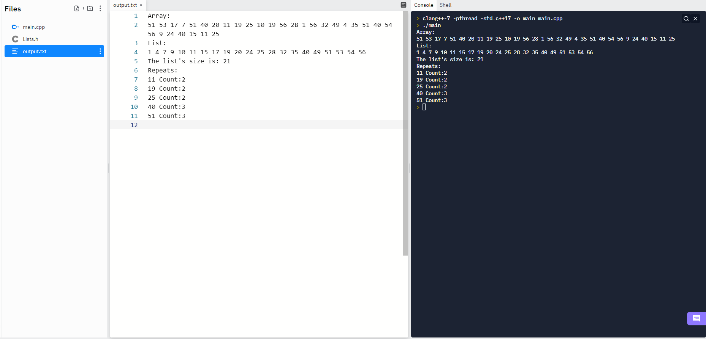

# Data Structures 1
### Assignment 1 for Data Structures class at Northeastern State University

##### This is purely backend programming with no UI

The progream starts by declaring an array of 30 integers and filling it with random numbers between 1 and 58. The array is then printed to the console and to a file called output.txt.

###### Stucture of the nodes in the linked list
```
struct node{
  int value;
  int number = 1;
  node * next = NULL;
};
```

Next the array is fed into a linked list. As each integer is added, it is placed in order from smallest to largest. If one of the integers is already in the list, the list node's "number" attribute is incremented by 1 instead of a new node being added to the list. The resulting linked list is then printed to the console, and to output.txt. The total number of nodes in the list is printed to the console, and to the file.

###### Function which is called multiple times from main to add each integer in the array to the linked list. Each integer is placed in order, with duplicates incrementing the "number" attribute instead of adding a new node.
```
void addNode(node * currentNode, int val){
  while(currentNode->next && val >= currentNode->next->value){
    if(currentNode->value == val){
      break;
    }else currentNode = currentNode->next;
  }
   if(currentNode->value == val){
      currentNode->number++;
    }else if(!currentNode->next){
    currentNode->next = new node;
    currentNode = currentNode->next;
    currentNode->value = val;
    }else{
    node * temp = currentNode->next;
    currentNode->next = new node;
    currentNode = currentNode->next;
    currentNode->value = val;
    currentNode->next = temp;
  }
}
```
A new aray is declared which will store each integer which was repeated in the original array. The function finds each node that has a "number" value greater than 1, and adds it to the new array. The result is An ordered array with all repeated numbers along with the number of times they were repeated.

#### Example output

